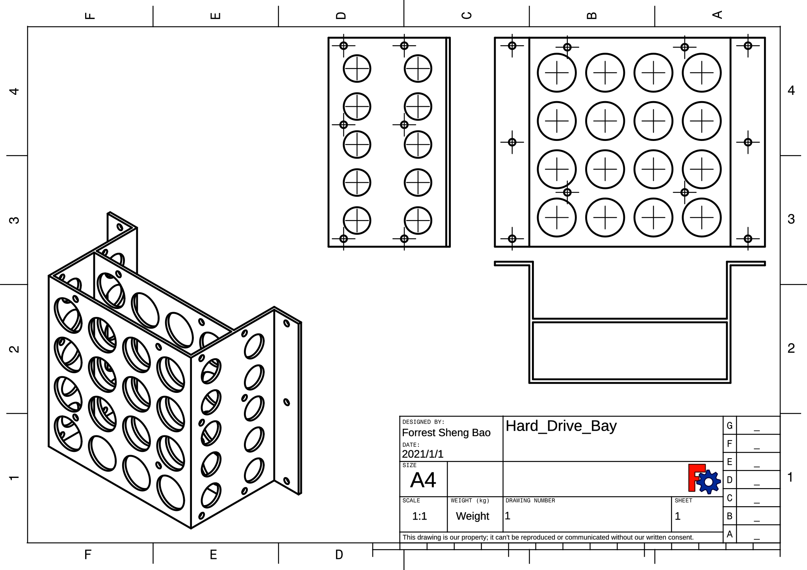

# Computer HDD/SSD bay

I designed this drive bay to mount hard drives or solid state drives to a customized computer case. It has two 3.5" spaces, which can mount two 3.5" HDDs or four 2.5" SSDs/HDDs. 

